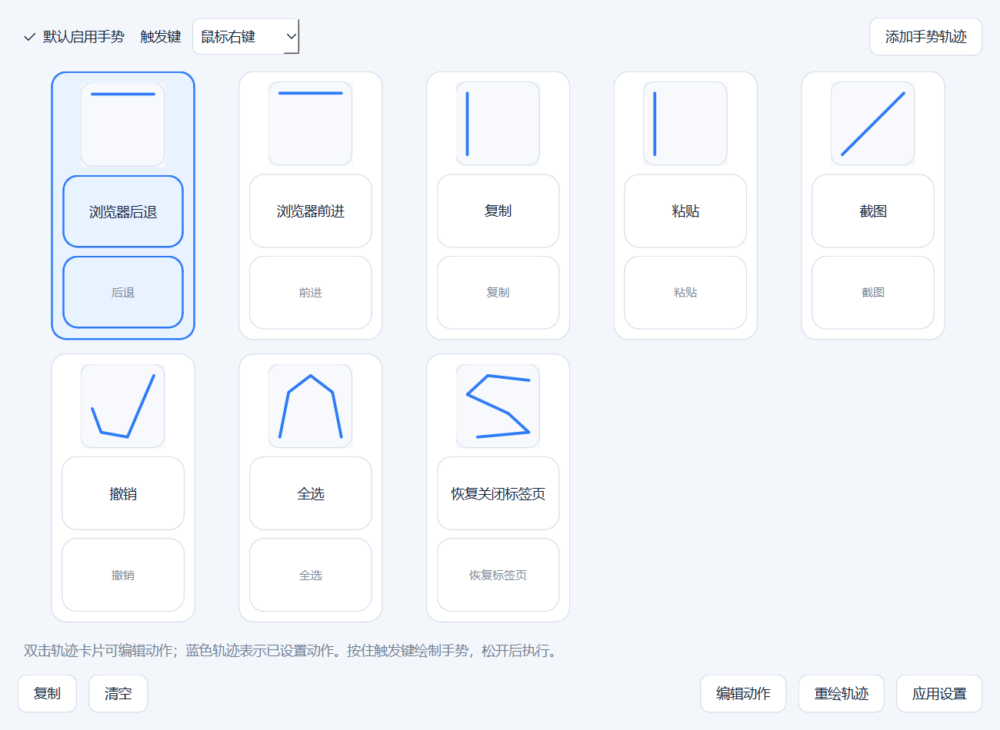
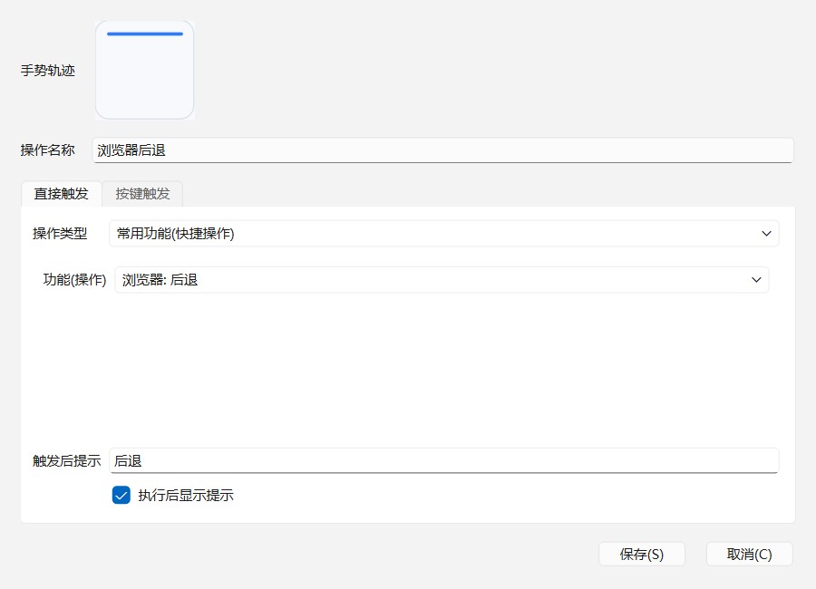

# MouseGestureStudio

MouseGestureStudio 是一个面向 Windows 的鼠标手势工具。按住鼠标右键画一个方向或轨迹，就能触发复制、粘贴、浏览器前进后退、截图、打开网址、输入日期文本、运行组合动作等操作。

[下载最新版安装包](https://github.com/liaozhu913/MouseGestureStudio/releases/latest)  
[直接下载 MouseGestureStudio-Setup-0.2.1.exe](https://github.com/liaozhu913/MouseGestureStudio/releases/latest/download/MouseGestureStudio-Setup-0.2.1.exe)

> 当前安装包未做代码签名，Windows 可能提示“未知发布者”。这是个人发布版的常见提示，确认来源是本仓库后可继续安装。
>
> 为了能在管理员权限的软件中也识别右键手势，安装版启动时会请求管理员权限。

## 界面预览





## 主要功能

- 全局鼠标手势识别
- 图形化管理手势轨迹和动作
- 内置常用动作：复制、粘贴、前进、后退、撤销、重做、全选、截图等
- 自定义发送快捷键，例如 `Alt+A`、`Ctrl+Shift+T`
- 自定义触发后延迟时间，适合等待目标窗口响应后再执行
- 输入文本、打开文件、打开网址、运行命令
- 日期格式选择框，一键写入常用日期文本
- 支持 JSON 组合动作，可导入更复杂的自动化步骤
- 托盘常驻运行、支持开机启动
- 安装版以管理员权限运行，增强对高权限软件的全局手势覆盖

## 安装使用

1. 打开 [Releases 下载页](https://github.com/liaozhu913/MouseGestureStudio/releases/latest)。
2. 下载 `MouseGestureStudio-Setup-0.2.1.exe`。
3. 双击安装包完成安装。
4. 启动后默认最小化到托盘，主界面可管理手势和动作。

默认操作方式：

- 默认触发键：`鼠标右键`
- 按住触发键并移动鼠标绘制手势
- 松开后执行匹配动作
- 如果几乎没有移动，会自动补发普通右键点击，不影响正常右键菜单

## 配置保存

用户手势配置保存到：

```text
%APPDATA%\MouseGestureStudio\settings.json
```

首次启动新版时，会自动从旧版运行目录中的 `data\settings.json` 迁移最近修改的一份配置，避免开发版、免安装版和安装版读到不同手势。

## 开发运行

```powershell
D:\MouseGestureStudio\.venv\Scripts\python.exe -m pip install -r D:\MouseGestureStudio\requirements.txt
D:\MouseGestureStudio\.venv\Scripts\python.exe D:\MouseGestureStudio\src\mouse_gesture_studio\main.py
```

## 本地打包

生成免安装应用目录：

```powershell
powershell -ExecutionPolicy Bypass -File D:\MouseGestureStudio\scripts\build.ps1
```

输出目录：

```text
D:\MouseGestureStudio\dist\MouseGestureStudio
```

生成 Windows 安装包：

```powershell
powershell -ExecutionPolicy Bypass -File D:\MouseGestureStudio\scripts\package-installer.ps1
```

输出文件：

```text
D:\MouseGestureStudio\artifacts\MouseGestureStudio-Setup-0.2.0.exe
```

## 项目结构

- `src\mouse_gesture_studio\` 应用源码
- `docs\workflow_json_spec.md` 组合动作 JSON 规则
- `docs\examples\` 组合动作示例
- `scripts\run.ps1` 开发启动脚本
- `scripts\build.ps1` PyInstaller 打包脚本
- `scripts\package-installer.ps1` 安装包生成脚本
